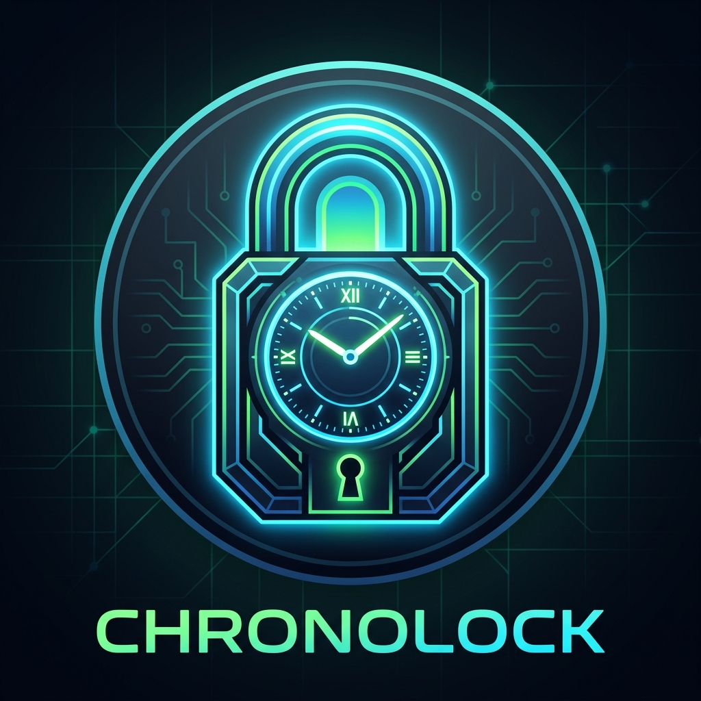

# ChronoLock ⏳🔒

ChronoLock is a secure, open-source **Time-Locked Vault** desktop application built with Python and CustomTkinter. 
It allows you to generate highly secure passwords (for app blockers, parental controls, or self-discipline) and forces a mandatory countdown timer before you can reveal them again.



## ✨ Features

- **Time-Locked Vaults:** Set a countdown (in minutes) that must be strictly waited out before revealing the password.
- **Robust Encryption:** Passwords are never saved in plain text. They are encrypted using `cryptography.fernet` with a locally generated key.
- **Anti-Cheat Mechanics:** Closing the application resets the countdown timer. You must keep the app open and wait the full duration.
- **Multilingual Support (i18n):** Real-time language switching without restarting. Supported languages:
  - 🇪🇸 Spanish
  - 🇬🇧 English
  - 🇫🇷 French
  - 🇷🇺 Russian
  - 🇯🇵 Japanese
  - 🇨🇳 Chinese
- **Modern GUI:** Built with `customtkinter` for a sleek, dark-mode native experience.
- **Portable:** Can be compiled into a standalone `.exe` using PyInstaller.

## 🚀 Installation & Usage

### Option 1: Run from source
1. Clone the repository:
   ```bash
   git clone https://github.com/yourusername/ChronoLock.git
   cd ChronoLock
   ```
2. Install the required dependencies:
   ```bash
   pip install -r requirements.txt
   ```
3. Run the application:
   ```bash
   python app.py
   ```

### Option 2: Build the executable (Windows)
If you want to create a standalone `.exe` file that doesn't require Python to be installed:
1. Run the build script:
   ```cmd
   build.bat
   ```
2. The executable will be generated inside the `dist/` folder.

## 🛠️ Built With
- [Python 3.11+](https://www.python.org/)
- [CustomTkinter](https://github.com/TomSchimansky/CustomTkinter) - Modern UI framework
- [Cryptography](https://cryptography.io/en/latest/) - Secure encryption protocols
- [PyInstaller](https://pyinstaller.org/en/stable/) - Executable packaging

## 🤝 Contributing
Contributions, issues, and feature requests are welcome!
Feel free to check the [issues page](https://github.com/yourusername/ChronoLock/issues).

## 📝 License
This project is [MIT](LICENSE) licensed.
